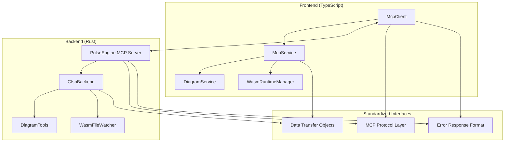

# Design Document

## Overview

This design addresses critical inconsistencies between the GLSP frontend (TypeScript) and backend (Rust) that are preventing proper communication and data synchronization. The system currently suffers from misaligned MCP protocol implementations, inconsistent data structures, and incompatible response formats.

## Architecture

### Current State Analysis

Based on code analysis, the following major inconsistencies have been identified:

1. **MCP Protocol Framework Mismatch**: 
   - Frontend uses custom MCP client implementation
   - Backend uses PulseEngine MCP framework 0.3.0
   - Response format expectations don't align

2. **Data Structure Inconsistencies**:
   - Field naming conventions (camelCase vs snake_case)
   - Optional field handling differences
   - Response wrapper format mismatches

3. **Tool Interface Misalignment**:
   - Parameter naming inconsistencies
   - Response content structure differences
   - Error handling format variations

### Target Architecture



## Components and Interfaces

### 1. MCP Protocol Standardization

**Problem**: Frontend expects direct JSON-RPC responses, backend uses PulseEngine wrapper format.

**Solution**: Create protocol adapter layer that handles both formats.

#### Frontend Changes:
- Update `McpClient.ts` to handle PulseEngine response format
- Modify response parsing in `McpService.ts`
- Add response format detection and adaptation

#### Backend Changes:
- Ensure PulseEngine configuration matches frontend expectations
- Standardize tool response format
- Implement consistent error response structure

### 2. Data Structure Alignment

**Problem**: Inconsistent field naming and optional field handling.

**Solution**: Define shared data transfer objects (DTOs) and implement consistent serialization.

#### Shared Data Structures:

```typescript
// Frontend interfaces to match backend structs
interface DiagramModel {
    id: string;
    name: string;
    diagramType: string; // Standardize on camelCase
    created: string;
    modified: string;
    elements: ModelElement[];
    metadata?: Record<string, unknown>;
}

interface WasmComponent {
    name: string;
    path: string;
    status: 'available' | 'missing' | 'error';
    interfaces: WasmInterface[];
    description?: string;
    version?: string;
}

interface McpToolResponse {
    content: Array<{
        type: string;
        text: string;
    }>;
    isError?: boolean; // Standardize on camelCase
}
```

#### Backend Rust Structs:
```rust
#[derive(Serialize, Deserialize)]
#[serde(rename_all = "camelCase")] // Force camelCase serialization
pub struct DiagramModel {
    pub id: String,
    pub name: String,
    pub diagram_type: String, // Will serialize as "diagramType"
    pub created: String,
    pub modified: String,
    pub elements: Vec<ModelElement>,
    pub metadata: Option<HashMap<String, Value>>,
}

#[derive(Serialize, Deserialize)]
#[serde(rename_all = "camelCase")]
pub struct WasmComponent {
    pub name: String,
    pub path: String,
    pub status: ComponentStatus,
    pub interfaces: Vec<WasmInterface>,
    pub description: Option<String>,
    pub version: Option<String>,
}
```

### 3. Tool Interface Standardization

**Problem**: Tool parameter names and response formats don't match between client and server.

**Solution**: Create standardized tool interface definitions and implement consistent parameter mapping.

#### Tool Response Wrapper:
```rust
// Backend - standardized tool response
#[derive(Serialize)]
#[serde(rename_all = "camelCase")]
pub struct StandardToolResponse {
    pub content: Vec<TextContent>,
    pub is_error: Option<bool>,
    pub metadata: Option<HashMap<String, Value>>,
}

impl From<StandardToolResponse> for CallToolResult {
    fn from(response: StandardToolResponse) -> Self {
        CallToolResult {
            content: response.content,
            is_error: response.is_error,
        }
    }
}
```

#### Frontend Response Handler:
```typescript
// Frontend - handle both direct and wrapped responses
async callTool(toolName: string, params: Record<string, unknown>): Promise<McpToolResponse> {
    const result = await this.mcpClient.callTool(toolName, params);
    
    // Handle PulseEngine wrapper format
    if (result && typeof result === 'object' && 'content' in result) {
        return {
            content: result.content || [],
            isError: result.isError || result.is_error || false
        };
    }
    
    // Handle direct format (fallback)
    return result as McpToolResponse;
}
```

### 4. Resource URI Consistency

**Problem**: Resource URI construction and handling differs between frontend and backend.

**Solution**: Implement standardized URI builder and resolver.

#### URI Standards:
- Diagrams: `diagram://list`, `diagram://model/{id}`
- WASM Components: `wasm://components`, `wasm://component/{name}`
- Resources: `resource://{type}/{id}`

#### Implementation:
```typescript
// Frontend URI builder
class ResourceUriBuilder {
    static diagramList(): string {
        return 'diagram://list';
    }
    
    static diagramModel(id: string): string {
        return `diagram://model/${encodeURIComponent(id)}`;
    }
    
    static wasmComponents(): string {
        return 'wasm://components';
    }
}
```

```rust
// Backend URI resolver
impl ResourceUriResolver {
    pub fn resolve_diagram_list() -> String {
        "diagram://list".to_string()
    }
    
    pub fn resolve_diagram_model(id: &str) -> String {
        format!("diagram://model/{}", urlencoding::encode(id))
    }
}
```

## Data Models

### Standardized Response Format

All MCP tool responses will follow this format:

```json
{
  "content": [
    {
      "type": "text",
      "text": "{\"data\": \"actual_response_data\"}"
    }
  ],
  "isError": false
}
```

### Error Response Format

```json
{
  "content": [
    {
      "type": "text", 
      "text": "{\"error\": \"Error message\", \"code\": \"ERROR_CODE\"}"
    }
  ],
  "isError": true
}
```

### WASM Component Data Format

```json
{
  "components": [
    {
      "name": "component-name",
      "path": "/path/to/component",
      "status": "available",
      "interfaces": [
        {
          "name": "interface-name",
          "type": "import|export",
          "functions": ["func1", "func2"]
        }
      ],
      "description": "Component description",
      "version": "1.0.0"
    }
  ]
}
```

## Error Handling

### Standardized Error Codes

- `TOOL_EXECUTION_ERROR`: Tool execution failed
- `INVALID_PARAMETERS`: Invalid tool parameters
- `RESOURCE_NOT_FOUND`: Requested resource not found
- `CONNECTION_ERROR`: MCP connection error
- `SERIALIZATION_ERROR`: Data serialization/deserialization error

### Error Response Chain

1. Backend catches error
2. Converts to standardized error format
3. Wraps in MCP tool response
4. Frontend receives and unwraps
5. Displays user-friendly error message

## Testing Strategy

### Unit Tests

1. **Protocol Compatibility Tests**:
   - Test MCP request/response format compatibility
   - Verify PulseEngine integration
   - Test error response handling

2. **Data Serialization Tests**:
   - Test camelCase/snake_case conversion
   - Verify optional field handling
   - Test nested object serialization

3. **Tool Interface Tests**:
   - Test all tool parameter mappings
   - Verify response format consistency
   - Test error condition handling

### Integration Tests

1. **End-to-End Communication Tests**:
   - Test full request/response cycle
   - Verify data integrity across protocol boundary
   - Test connection recovery scenarios

2. **WASM Component Integration**:
   - Test component scanning and loading
   - Verify interface data transmission
   - Test component execution flow

### Compatibility Tests

1. **Backward Compatibility**:
   - Test with existing diagram files
   - Verify WASM component compatibility
   - Test configuration migration

2. **Cross-Platform Tests**:
   - Test on different operating systems
   - Verify path handling consistency
   - Test network communication reliability