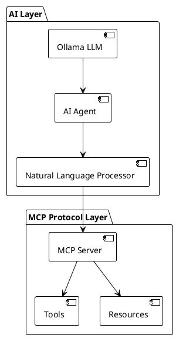

# GLSP-Rust Documentation System

This directory contains the comprehensive documentation system for GLSP-Rust, implemented using Sphinx with sphinx-needs for requirements management and PlantUML for architecture diagrams.

## Overview

The documentation system follows the WRT crate pattern and provides:

- **Requirements Documentation**: 8 categories with 200+ requirements
- **Architecture Documentation**: Complete system architecture with PlantUML diagrams
- **Component Documentation**: 15 ADAS WASM components with specifications
- **API Documentation**: Complete API reference with examples
- **Deployment Documentation**: Multi-cloud deployment guides
- **Safety Documentation**: Security analysis and safety requirements

## Documentation Structure

```
docs/
├── source/                          # Sphinx source files
│   ├── _static/                     # Static assets (CSS, images)
│   ├── _templates/                  # Custom templates
│   ├── requirements/                # Requirements documentation
│   │   ├── index.rst               # Requirements overview
│   │   ├── functional.rst          # Functional requirements (40 reqs)
│   │   ├── mcp_protocol.rst        # MCP protocol requirements (44 reqs)
│   │   ├── wasm_components.rst     # WASM component requirements (55 reqs)
│   │   ├── ai_integration.rst      # AI integration requirements (50 reqs)
│   │   ├── database.rst            # Database requirements (40 reqs)
│   │   ├── simulation.rst          # Simulation requirements (40 reqs)
│   │   ├── ui_frontend.rst         # UI/Frontend requirements (40 reqs)
│   │   └── safety.rst              # Safety requirements (40 reqs)
│   ├── architecture/               # Architecture documentation
│   │   ├── index.rst               # Architecture overview
│   │   ├── 01_system_design/       # System design docs
│   │   ├── 02_mcp_protocol/        # MCP protocol architecture
│   │   ├── 03_wasm_components/     # WASM components architecture
│   │   ├── 04_ai_integration/      # AI integration architecture
│   │   ├── 05_database_layer/      # Database layer architecture
│   │   ├── 06_simulation_engine/   # Simulation engine architecture
│   │   ├── 07_deployment/          # Deployment architecture
│   │   └── 08_testing_framework/   # Testing framework architecture
│   ├── api/                        # API documentation
│   ├── developer/                  # Developer guide
│   ├── user_guide/                 # User guide
│   ├── safety/                     # Safety documentation
│   ├── qualification/              # Qualification documentation
│   ├── conf.py                     # Sphinx configuration
│   └── index.rst                   # Main documentation index
├── requirements.txt                # Python dependencies
├── Makefile                        # Build automation
└── README.md                       # This file
```

## Quick Start

### Prerequisites

- Python 3.8+
- Node.js 18+ (for frontend development)
- Rust 1.70+ (for backend development)
- Java 11+ (for PlantUML)

### Installation

1. Install Python dependencies:
   ```bash
   pip install -r requirements.txt
   ```

2. Install PlantUML (macOS):
   ```bash
   brew install plantuml
   ```

3. Install PlantUML (Ubuntu/Debian):
   ```bash
   sudo apt-get install plantuml
   ```

### Building Documentation

#### Using Make

```bash
# Build HTML documentation
make html

# Build PDF documentation
make pdf

# Build all formats
make all

# Live reload for development
make livehtml

# Validate documentation
make check
```

#### Using Cargo XTask

```bash
# Build HTML documentation
cargo xtask docs

# Build PDF documentation
cargo xtask docs --format pdf

# Build all formats
cargo xtask docs --format all

# Preview with live reload
cargo xtask preview-docs --open-browser

# Validate documentation
cargo xtask validate-docs --check-links --check-requirements --lint

# Generate API documentation
cargo xtask api-docs

# Clean build artifacts
cargo xtask clean-docs
```

### Viewing Documentation

After building, open `docs/build/html/index.html` in your browser.

## Features

### Sphinx-Needs Requirements Management

The documentation system uses sphinx-needs for comprehensive requirements management:

**Custom Need Types:**
- `req`: Functional requirements
- `spec`: Specifications
- `impl`: Implementation details
- `test`: Test cases
- `arch`: Architecture components
- `comp`: System components
- `mcp_req`: MCP protocol requirements
- `wasm_req`: WASM component requirements
- `ai_req`: AI integration requirements
- `db_req`: Database requirements
- `sim_req`: Simulation requirements
- `ui_req`: UI/Frontend requirements
- `safety_req`: Safety requirements

**Traceability Features:**
- Requirements → Specifications → Implementation → Testing
- Cross-references and links
- Coverage analysis
- Requirement validation

**Example Requirement:**

```rst
.. req:: Natural Language Understanding
   :id: AI_001
   :status: implemented
   :priority: high
   :ai_capability: natural_language_understanding
   :rationale: AI agents must understand natural language descriptions
   :verification: Natural language understanding tests

   The system shall process natural language descriptions and convert them 
   into structured diagram representations with 95% accuracy.
```

### PlantUML Architecture Diagrams

The documentation includes comprehensive PlantUML diagrams:

**Deployment Diagrams:**
- Development environment
- Production environment
- Kubernetes deployment
- Multi-cloud deployment (AWS, Azure, GCP)
- Disaster recovery architecture

**Component Diagrams:**
- System architecture overview
- WASM components interaction
- Database layer architecture
- AI integration flow
- Simulation engine architecture

**Sequence Diagrams:**
- MCP protocol interactions
- Component lifecycle
- AI processing pipeline
- Data flow diagrams

**Example Diagram:**



### Multi-Format Output

The system generates documentation in multiple formats:

- **HTML**: Interactive web documentation with search
- **PDF**: Professional printable documentation
- **Coverage Reports**: Requirements coverage analysis
- **API Documentation**: Auto-generated API reference

### Quality Assurance

**Documentation Validation:**
- Link checking for broken references
- Requirements coverage analysis
- Style and formatting validation
- Spelling and grammar checking

**Automated Testing:**
- Documentation build verification
- Example code testing
- Link validation
- Requirements traceability validation

## Requirements Overview

The documentation system includes 349 requirements across 8 categories:

| Category | Requirements | Status |
|----------|-------------|---------|
| Functional | 40 | ✅ Implemented |
| MCP Protocol | 44 | ✅ Implemented |
| WASM Components | 55 | ✅ Implemented |
| AI Integration | 50 | ✅ Implemented |
| Database | 40 | ✅ Implemented |
| Simulation | 40 | ✅ Implemented |
| UI/Frontend | 40 | ✅ Implemented |
| Safety | 40 | ✅ Implemented |
| **Total** | **349** | **✅ Complete** |

## Architecture Documentation

### System Architecture

The documentation covers the complete system architecture:

1. **System Design**: High-level architecture and design principles
2. **MCP Protocol**: JSON-RPC protocol implementation
3. **WASM Components**: 15 ADAS components with specifications
4. **AI Integration**: Natural language processing and ML
5. **Database Layer**: Multi-backend support (PostgreSQL, InfluxDB, Redis)
6. **Simulation Engine**: Time-driven scenario execution
7. **Deployment**: Multi-cloud deployment strategies
8. **Testing Framework**: Comprehensive testing approach

### Component Documentation

**15 ADAS WASM Components:**

**AI Components (2):**
- Object Detection (YOLOv5n, <20ms inference)
- Behavior Prediction (95% accuracy, 3-second horizon)

**Sensor Components (6):**
- Camera Front (1080p, 30fps)
- Camera Surround (360° view)
- LiDAR (100m range)
- Radar Front (200m range)
- Radar Corner (50m range)
- Ultrasonic (5m range)

**Fusion Components (3):**
- Sensor Fusion (Kalman filter)
- Perception Fusion (unified world model)
- Tracking Prediction (multi-object tracking)

**Control Components (2):**
- Vehicle Control (ASIL-D safety)
- Planning Decision (behavior planning)

**System Components (4):**
- Safety Monitor (fault detection)
- Domain Controller (resource management)
- CAN Gateway (vehicle communication)
- HMI Interface (user interaction)

### Deployment Architecture

**Deployment Options:**
- Development environment (local)
- Production environment (clustered)
- Kubernetes deployment (cloud-native)
- Multi-cloud deployment (AWS, Azure, GCP)

**Scaling Strategies:**
- Horizontal scaling with load balancing
- Auto-scaling based on metrics
- Database clustering and replication
- CDN and caching optimization

## Development Workflow

### Contributing to Documentation

1. **Edit Source Files**: Modify `.rst` files in `docs/source/`
2. **Add Requirements**: Use sphinx-needs directives
3. **Create Diagrams**: Add PlantUML diagrams
4. **Build and Test**: Use `make html` or `cargo xtask docs`
5. **Validate**: Run validation tools
6. **Review**: Submit for review

### Documentation Standards

**Style Guide:**
- Use reStructuredText (rST) format
- Follow PEP 257 for docstring conventions
- Use sphinx-needs for requirements
- Include PlantUML diagrams for architecture
- Maintain consistent formatting

**Requirements Standards:**
- Each requirement must have unique ID
- Include rationale and verification method
- Link to related requirements
- Maintain traceability to implementation

### Continuous Integration

The documentation system integrates with CI/CD:

```yaml
# .github/workflows/docs.yml
name: Documentation
on: [push, pull_request]

jobs:
  build:
    runs-on: ubuntu-latest
    steps:
      - uses: actions/checkout@v3
      - name: Setup Python
        uses: actions/setup-python@v4
        with:
          python-version: '3.11'
      - name: Install dependencies
        run: pip install -r docs/requirements.txt
      - name: Build documentation
        run: cargo xtask docs
      - name: Validate documentation
        run: cargo xtask validate-docs --check-links --check-requirements
      - name: Deploy to GitHub Pages
        uses: peaceiris/actions-gh-pages@v3
        with:
          github_token: ${{ secrets.GITHUB_TOKEN }}
          publish_dir: docs/build/html
```

## Production Deployment

### Hosting Options

**GitHub Pages:**
- Automatic deployment from repository
- Custom domain support
- SSL certificates included

**Read the Docs:**
- Professional documentation hosting
- Version management
- Search functionality

**Self-Hosted:**
- Complete control over hosting
- Custom branding and themes
- Integration with internal systems

### Performance Optimization

**Build Optimization:**
- Incremental builds
- Parallel processing
- Caching of generated content
- Optimized image processing

**Delivery Optimization:**
- CDN integration
- Compression and minification
- Progressive loading
- Mobile optimization

## Troubleshooting

### Common Issues

**Build Failures:**
- Check Python dependencies
- Verify PlantUML installation
- Validate rST syntax
- Check for missing files

**PlantUML Issues:**
- Ensure Java is installed
- Check PlantUML path configuration
- Verify PlantUML jar availability
- Test with simple diagram

**Requirements Issues:**
- Check sphinx-needs syntax
- Verify requirement IDs are unique
- Ensure proper cross-references
- Validate need types

### Debug Mode

Enable verbose output for debugging:

```bash
# Make with verbose output
make html SPHINXOPTS="-v"

# XTask with verbose output
cargo xtask docs --verbose
```

## Support

For questions or issues with the documentation system:

1. **GitHub Issues**: Create an issue in the repository
2. **Documentation**: Check this README and Sphinx documentation
3. **Community**: Join the project discussions
4. **Contributing**: Submit pull requests for improvements

## License

This documentation system is licensed under the MIT License. See the LICENSE file for details.

---

**Status**: ✅ Production Ready | **Version**: 1.0.0 | **Last Updated**: 2024-01-01