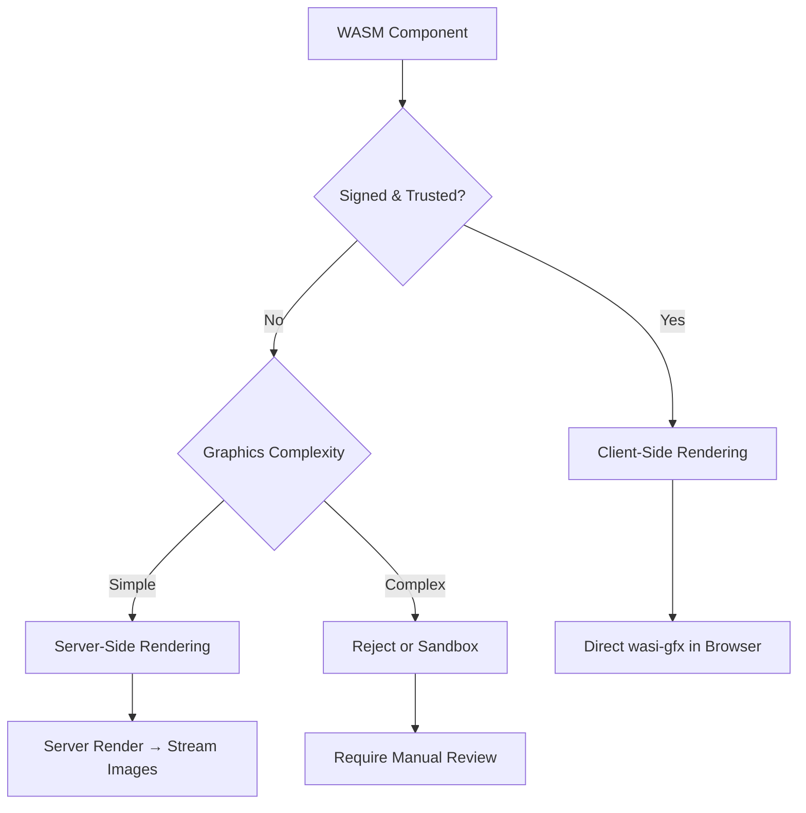

# WASM Graphics Visualization Architecture

## Executive Summary

This document analyzes the architectural options for WASM component graphics visualization, considering security, performance, and implementation complexity.

## Background

- We have WASM components that can generate visualizations using wasi-gfx
- Reference implementation: https://wasi-gfx.github.io/playground/
- Key decision: Where to execute graphics rendering - client or server?

## Security Analysis

### Client-Side Rendering Risks

1. **Untrusted Code Execution**
   - WASM runs in browser sandbox, but still poses risks
   - Potential for browser exploits (though rare)
   - Resource consumption attacks (CPU/memory)
   - Canvas fingerprinting and privacy concerns

2. **Data Exfiltration**
   - Graphics components could encode sensitive data in visuals
   - Timing attacks through rendering patterns
   - Side-channel attacks via WebGL/Canvas APIs

3. **Supply Chain Attacks**
   - Malicious components masquerading as visualization tools
   - Backdoors in graphics libraries
   - Dependency confusion attacks

### Server-Side Rendering Security

1. **Advantages**
   - Complete isolation from client environment
   - Resource limits enforced by Wasmtime
   - No direct access to user's browser/system
   - Can inspect/validate all output before sending

2. **Remaining Risks**
   - Server resource consumption
   - Potential for server-side exploits (mitigated by Wasmtime sandbox)
   - Network traffic amplification

## WASM Component Signing

### Current State (2025)

1. **WebAssembly Component Model**
   - No built-in signing mechanism in the spec
   - Components are just bytes - can be signed externally

2. **Existing Solutions**
   - **WASI Crypto**: Provides crypto primitives but not signing infrastructure
   - **External signing**: Use standard PKI to sign .wasm files
   - **Registry-based trust**: Similar to Docker Hub verified publishers

### Proposed Signing Architecture

```rust
// Signature embedded in custom section
pub struct SignedComponent {
    wasm_bytes: Vec<u8>,
    signature: ComponentSignature,
}

pub struct ComponentSignature {
    algorithm: SignatureAlgorithm,
    public_key_id: String,
    signature: Vec<u8>,
    timestamp: u64,
    metadata: SignatureMetadata,
}

pub struct SignatureMetadata {
    signer: String,
    version: String,
    capabilities: Vec<String>, // e.g., ["graphics", "compute"]
    security_level: SecurityLevel,
}

pub enum SecurityLevel {
    Untrusted,
    CommunityVerified,
    PublisherSigned,
    EnterpriseTrusted,
}
```

## Performance Analysis

### Client-Side Rendering

**Advantages:**
- Zero network latency for graphics updates
- Leverages client GPU via WebGL/WebGPU
- Scales with number of clients
- Interactive graphics respond instantly

**Disadvantages:**
- Initial WASM download size (can be cached)
- Client resource consumption
- Inconsistent performance across devices

### Server-Side Rendering

**Advantages:**
- Consistent performance
- No client resource usage
- Smaller network payload (just images/commands)
- Works on low-end devices

**Disadvantages:**
- Network latency (critical for interactive graphics)
- Server resource scaling challenges
- Bandwidth for streaming graphics
- Frame rate limitations

### Latency Analysis

```
Client-side:
- Input → Render: ~1-5ms
- Total latency: 1-5ms

Server-side:
- Input → Network → Process → Render → Encode → Network → Display
- Total latency: 20-100ms (depending on network)
```

## Architectural Recommendations

### Hybrid Trust-Based Architecture



### Implementation Strategy

1. **Phase 1: Server-Side Only** (Safest, Simplest)
   ```rust
   pub async fn render_component_graphics(
       component_id: &str,
       input_data: &[u8],
   ) -> Result<GraphicsOutput> {
       let output = self.wasm_engine
           .execute_sandboxed(component_id, "render", input_data)
           .await?;
       
       match output {
           GraphicsOutput::Image(data) => Ok(GraphicsOutput::Image(data)),
           GraphicsOutput::SVG(xml) => {
               // Sanitize SVG before sending
               let safe_svg = sanitize_svg(&xml)?;
               Ok(GraphicsOutput::SVG(safe_svg))
           }
           GraphicsOutput::Canvas(commands) => {
               // Convert to safe image format
               let image = rasterize_canvas_commands(&commands)?;
               Ok(GraphicsOutput::Image(image))
           }
       }
   }
   ```

2. **Phase 2: Trusted Component Client Rendering**
   ```typescript
   // Client-side component loader with verification
   class TrustedComponentLoader {
       async loadComponent(
           componentUrl: string, 
           signature: ComponentSignature
       ): Promise<WasmComponent> {
           const bytes = await fetch(componentUrl);
           
           // Verify signature
           if (!await this.verifySignature(bytes, signature)) {
               throw new Error("Invalid component signature");
           }
           
           // Check security level
           if (signature.metadata.security_level < SecurityLevel.PublisherSigned) {
               throw new Error("Insufficient trust level for client execution");
           }
           
           // Load with restricted imports
           return await this.loadWithSandbox(bytes, {
               allowedImports: ['wasi-gfx', 'wasi-io'],
               maxMemory: 100 * 1024 * 1024, // 100MB
               maxExecutionTime: 1000, // 1s
           });
       }
   }
   ```

3. **Phase 3: Progressive Enhancement**
   - Start with server-side rendering
   - Measure latency and bandwidth
   - Progressively upgrade to client-side for trusted components
   - Fall back to server-side on errors

### Security Policies

```yaml
wasm_graphics_policy:
  untrusted_components:
    execution: server_only
    max_resolution: 1920x1080
    max_fps: 10
    output_formats: [png, jpeg, svg]
    
  community_verified:
    execution: server_only
    max_resolution: 4K
    max_fps: 30
    output_formats: [png, jpeg, svg, webp]
    
  publisher_signed:
    execution: client_allowed
    requires_user_consent: true
    sandbox_restrictions:
      - no_network_access
      - no_filesystem_access
      - memory_limit: 256MB
      - cpu_time_limit: 5s
      
  enterprise_trusted:
    execution: client_preferred
    requires_user_consent: false
    sandbox_restrictions:
      - memory_limit: 1GB
      - cpu_time_limit: 30s
```

## Recommended Architecture

### Short Term (Safe, Simple)
1. **Server-side rendering only**
2. Stream results as PNG/SVG/WebP
3. Use HTTP/2 Server-Sent Events for updates
4. Cache rendered frames

### Medium Term (Balanced)
1. Implement component signing infrastructure
2. Add trust levels and verification
3. Enable client-side for signed components only
4. Maintain server-side fallback

### Long Term (Optimal)
1. ML-based risk assessment of components
2. Automatic performance profiling
3. Dynamic client/server routing based on:
   - Network conditions
   - Client capabilities
   - Component trust level
   - Graphics complexity

## Implementation Checklist

- [ ] Implement server-side wasi-gfx renderer
- [ ] Add component signing infrastructure
- [ ] Create signature verification service
- [ ] Build trust level management system
- [ ] Implement client-side sandbox
- [ ] Add performance monitoring
- [ ] Create fallback mechanisms
- [ ] Document security policies

## Conclusion

Given the security risks and current limitations, we recommend:

1. **Start with server-side rendering** for all WASM graphics
2. **Implement component signing** as a parallel effort
3. **Gradually enable client-side** for trusted components only
4. **Monitor performance** and adjust architecture as needed

This approach prioritizes security while maintaining a path to optimal performance for trusted components.