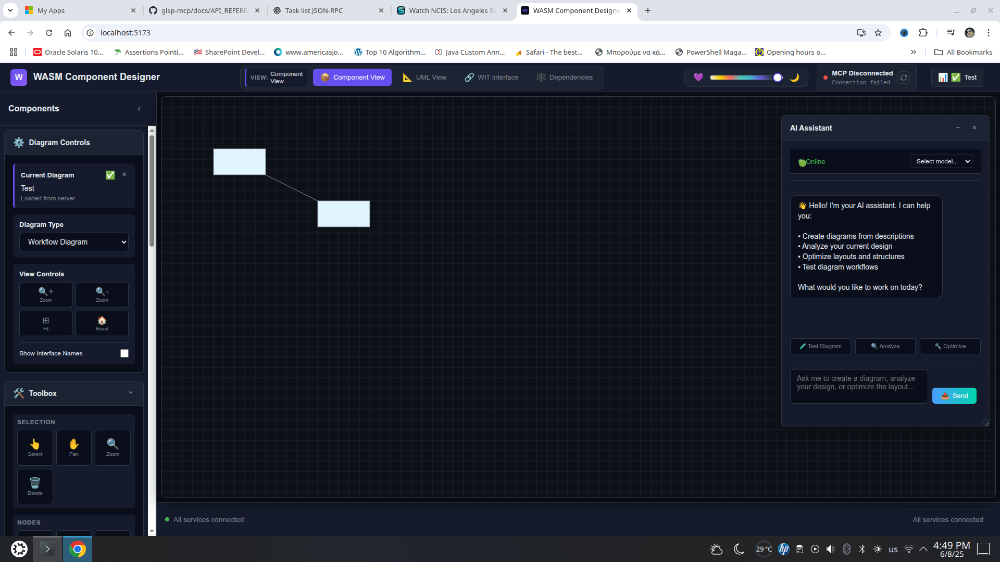

# 🛠 Tasklist MCP Client

This Rust client connects to an MCP-compatible server via JSON-RPC to:

- Create a new diagram
- Add task nodes
- Connect them with transitions (edges)

It works with the [WASM Component Designer](https://github.com/eclipse-glsp/glsp-mcp) or any GLSP-based frontend that supports MCP.

---

## 🚀 Features

- ✅ Creates workflow diagrams via MCP JSON-RPC
- ✅ Dynamically maps server-assigned node IDs
- ✅ Visualizes task nodes and connections
- ✅ Easy to extend or adapt to new diagram types

---

## 🧪 Screenshot

The image below shows the generated diagram rendered in the WASM Component Designer:



---

## 🔧 Usage

### Prerequisites

- Rust installed (`cargo`)
- MCP server running at `http://127.0.0.1:3000/messages`
- WASM Component Designer frontend running (e.g., on `http://localhost:5173`)

### Run the client

```bash
cargo run

