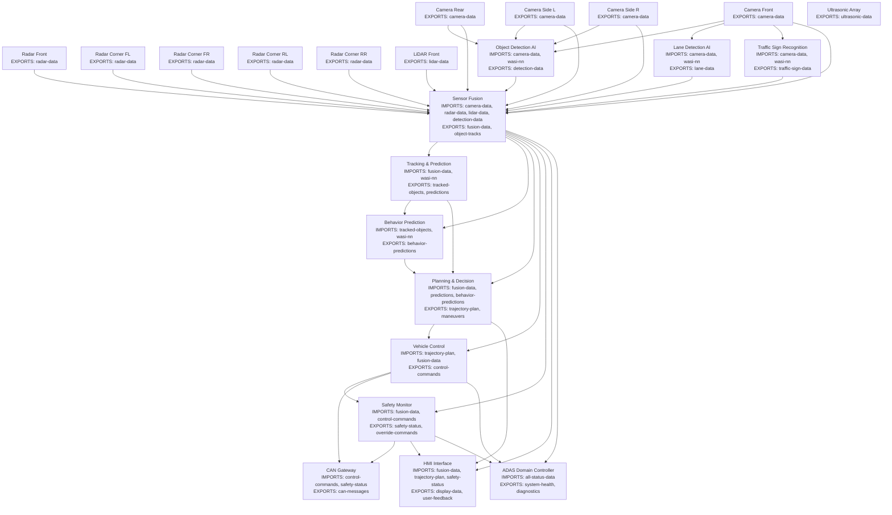

# ADAS Component Architecture

## Component Connection Graph

## Data Flow Architecture

### Layer 1: Sensor Data Production (100Hz)
- **Camera ECUs**: Export raw image frames at 30-60 fps
- **Radar ECUs**: Export point cloud targets at 20 Hz  
- **LiDAR ECU**: Export 3D point clouds at 10-20 Hz
- **Ultrasonic**: Export distance measurements at 40 Hz

### Layer 2: AI Perception (10-30Hz)
- **Object Detection**: Processes camera frames, detects vehicles/pedestrians/cyclists
- **Lane Detection**: Identifies lane markings, road boundaries
- **Traffic Sign Recognition**: Detects and classifies traffic signs/lights

### Layer 3: Sensor Fusion (20Hz)
- Combines all sensor inputs into unified 3D environment model
- Associates detections across sensors
- Maintains consistent object tracks
- Generates free-space map

### Layer 4: Prediction (10Hz)
- **Tracking**: Maintains temporal consistency of objects
- **Trajectory Prediction**: Predicts future paths of detected objects
- **Behavior Prediction**: Predicts intentions (lane change, turning, etc.)

### Layer 5: Planning & Decision (10Hz)
- Generates safe trajectory plans
- Makes tactical decisions (lane change, overtake, follow)
- Considers predictions and traffic rules

### Layer 6: Control (50Hz)
- Converts plans to vehicle control commands
- Manages longitudinal control (speed/acceleration)
- Manages lateral control (steering)

### Layer 7: Safety & Actuation (100Hz)
- **Safety Monitor**: Validates all commands, can override
- **CAN Gateway**: Translates to vehicle-specific CAN messages

### Layer 8: Human Machine Interface (30Hz)
- Visualizes environment and system status
- Handles user inputs and preferences
- Provides warnings and alerts

## Component Details

### Sensor Components (Data Producers)

1. **Camera ECUs** (4 components)
   - Front: Wide FOV for general perception
   - Rear: Backup and rear cross-traffic
   - Side Left/Right: Blind spot and lane change

2. **Radar ECUs** (5 components)
   - Front Long Range: ACC, AEB
   - Corner (4x): Cross-traffic, blind spot

3. **LiDAR ECU** (1 component)
   - 360° or front-facing high-resolution 3D

4. **Ultrasonic Array** (1 component)
   - Close-range parking assistance

### AI Components (Import sensors + WASI-NN)

1. **Object Detection AI**
   - YOLOv8 or EfficientDet model
   - Detects: vehicles, pedestrians, cyclists, etc.

2. **Lane Detection AI**
   - Semantic segmentation model
   - Lane lines, road edges, crosswalks

3. **Traffic Sign Recognition**
   - Classification + OCR models
   - Speed limits, traffic lights, signs

### Fusion & Tracking Components

1. **Sensor Fusion**
   - Multi-sensor Kalman filtering
   - Data association across sensors
   - Occupancy grid generation

2. **Tracking & Prediction**
   - Multi-object tracking (MOT)
   - Trajectory prediction using LSTM/Transformer

3. **Behavior Prediction**
   - Intent prediction neural networks
   - Lane change, turn, stop predictions

### Planning & Control Components

1. **Planning & Decision**
   - Behavior planning state machine
   - Trajectory optimization
   - Cost function evaluation

2. **Vehicle Control**
   - MPC (Model Predictive Control)
   - PID controllers for actuators
   - Vehicle dynamics model

### Safety & Infrastructure

1. **Safety Monitor**
   - Redundant safety checks
   - Fail-safe mechanisms
   - ISO 26262 compliance

2. **CAN Gateway**
   - Protocol translation
   - Message routing
   - Diagnostic support

3. **HMI Interface**
   - Real-time visualization
   - Warning generation
   - User interaction

4. **ADAS Domain Controller**
   - System orchestration
   - Health monitoring
   - OTA updates

## Key Design Principles

1. **Decoupled Architecture**: Each component has clear interfaces
2. **Data Flow**: Unidirectional data flow from sensors to actuators
3. **Fail-Safe**: Safety monitor can override at any time
4. **Scalable**: Easy to add/remove sensors or features
5. **Real-Time**: Designed for deterministic execution
6. **Standards**: ISO 26262, AUTOSAR Adaptive compatible