# ADAS WebAssembly Production Showcase

> **Production-Grade Automotive ADAS Demonstration**  
> Real-time video processing, AI object detection, and safety decision-making in WebAssembly

## 🚗 Overview

This showcase demonstrates a complete **automotive ADAS (Advanced Driver Assistance Systems)** pipeline implemented in **WebAssembly components** with production-grade interfaces and **ISO 26262 ASIL-B** compliance patterns.

### Architecture: 4-Component Pipeline

```mermaid
graph LR
    A["📹 Video Decoder<br/>320x200@25fps"] --> B["🧠 AI Object Detection<br/>YOLOv5n ONNX"]
    B --> C["⚙️ Data Pipeline<br/>Decision Engine"]
    C --> D["📊 Visualizer<br/>Real-time Dashboard"]
    
    style A fill:#e1f5fe
    style B fill:#f3e5f5
    style C fill:#e8f5e8
    style D fill:#fff3e0
```



## 🎯 Production Features

- **🏎️ Real-Time Performance**: <100ms total pipeline latency (ASIL-B compliance)
- **🧠 Production AI**: YOLOv5n ONNX model (3.8MB) with WASI-NN integration
- **📹 Embedded Video**: 3.3MB CarND driving footage for realistic demo
- **🛡️ Safety Monitoring**: ISO 26262 patterns with emergency stop capabilities
- **📊 Live Dashboard**: WebSocket-based real-time metrics and controls
- **🔧 Component Health**: Comprehensive diagnostics and performance monitoring

## 🚀 Quick Start

### Prerequisites

- **Rust** 1.70+ with `wasm32-wasip2` target
- **Node.js** 18+ (for dashboard assets)
- **wasmtime** 24.0+ with component model support

```bash
# Install Rust WASM target
rustup target add wasm32-wasip2

# Install wasmtime
curl https://wasmtime.dev/install.sh -sSf | bash
```

### Build & Run Demo

```bash
# 1. Build all showcase components
cd showcase
cargo build --release --target wasm32-wasip2

# 2. Start the production demo orchestrator
cargo run --bin demo-orchestrator -- --auto-cycle --demo-duration 30

# 3. Open dashboard in browser
open http://localhost:8080
```

### Dashboard Interface

🌐 **http://localhost:8080** - Real-time automotive dashboard with:

- **Scene Visualization**: Live object detection overlay
- **Pipeline Flow**: Real-time component latency monitoring  
- **Safety Assessment**: Threat level and intervention status
- **Component Health**: Individual component performance metrics
- **System Alerts**: Real-time safety and performance notifications
- **Demo Controls**: Start, stop, pause, reset, and cycle controls

## 📊 Performance Targets

| Component | Target Latency | Memory Usage | CPU Utilization |
|-----------|---------------|--------------|----------------|
| Video Decoder | <5ms | 8MB | 12% |
| AI Detection | <35ms | 512MB | 45% |
| Data Pipeline | <15ms | 32MB | 25% |
| Visualizer | <16ms | 24MB | 15% |
| **Total Pipeline** | **<100ms** | **~600MB** | **~75%** |

## 🛡️ Safety & Compliance

### ISO 26262 ASIL-B Patterns

- **Real-time Deadlines**: 100ms total pipeline latency limit
- **Safety Monitoring**: Continuous threat assessment and intervention
- **Fault Detection**: Component health monitoring with degraded mode handling
- **Emergency Stop**: Automatic safety shutdown on consecutive failures
- **Diagnostic Coverage**: Comprehensive self-testing and validation

## 🎬 Demo Scenarios

### 30-Second Auto-Cycling Demo

1. **Initialization** (0-2s): Load components and initialize systems
2. **Normal Driving** (2-15s): Standard cruise control with light traffic
3. **Traffic Scenario** (15-22s): Multiple objects detected, adaptive cruise activated
4. **Emergency Scenario** (22-28s): Pedestrian detected, emergency braking triggered
5. **Recovery** (28-30s): Return to normal operation, cycle complete

### Interactive Controls

- **▶️ Start**: Begin demo pipeline execution
- **⏸️ Pause**: Pause processing while maintaining state
- **⏹️ Stop**: Stop pipeline and reset to idle
- **🔄 Cycle**: Restart current demo cycle
- **🔄 Reset**: Full system reset to initial state